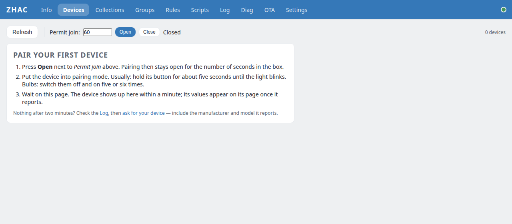
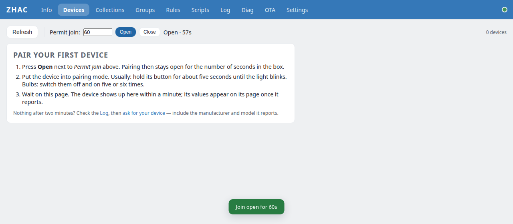
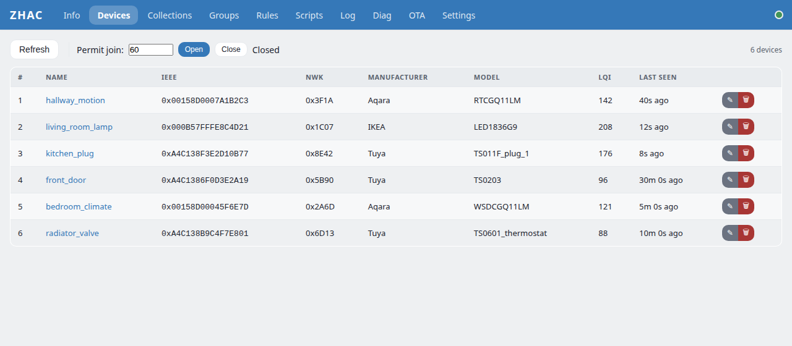
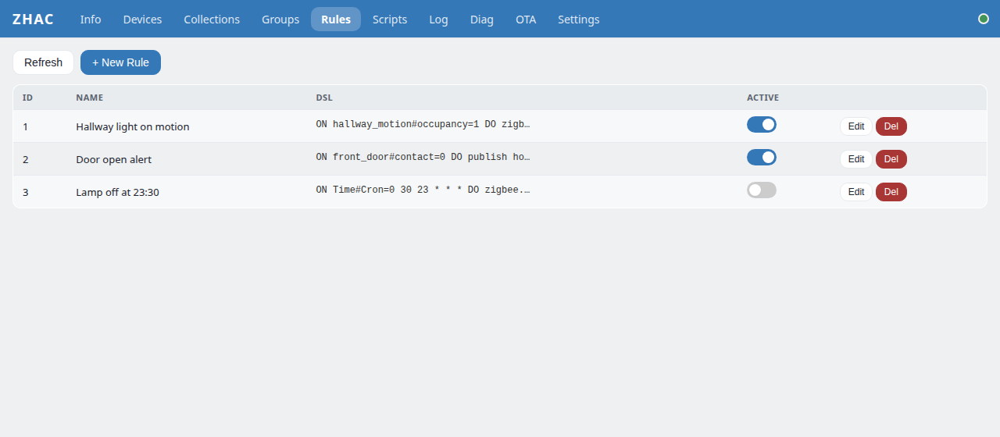

<!--
SPDX-FileCopyrightText: 2025-2026 Evgenij Cjura and project contributors
SPDX-License-Identifier: AGPL-3.0-or-later
-->

# Your first 20 minutes with ZHAC

From a bare board to a Zigbee sensor switching a lamp, without installing a toolchain.
This guide uses the **wired** build: one ESP32-P4 board with an Ethernet jack. Nothing
here needs Wi-Fi setup, a Raspberry Pi or a cloud account.

> **Status, honestly.** The wired P4 build compiles and shares its code with the ESP32-S31
> build, which does run on hardware — but the P4 image itself has not yet been run on a
> Guition board by the maintainers. If a step below does not match what you see,
> [tell us](https://github.com/zhac-project/zhac-platform/issues/new?template=bug.yml);
> that report is exactly what is missing.

## What you need

- A **Guition JC-ESP32P4-M3-DEV** (about $14), or another ESP32-P4 board with Ethernet
  — see the [board list](https://github.com/zhac-project/zhac-wired-core#boards).
- A USB-C **data** cable (charge-only cables are a classic time sink) and an Ethernet
  cable to your router.
- **Chrome or Edge** on a desktop computer.
- Once, for the Zigbee radio chip: a **3.3 V USB-serial adapter** and three jumper wires.
- A Zigbee device to pair: a contact sensor, a plug, a bulb.

## 1. Check the chip (2 minutes)

ESP32-P4 chips come in two families that cannot run each other's firmware. ZHAC's image
is built for **v0.x–v1.x**.

1. Plug the board's USB-C port into your computer.
2. Open [espressif.github.io/esptool-js](https://espressif.github.io/esptool-js/),
   press **Connect** and pick the board's port.
3. Read the chip line: `ESP32-P4 (revision v1.3)` means go ahead. A `v3.x` revision will
   not boot this image — [send a board report](https://github.com/zhac-project/zhac-platform/issues/new?template=board-report.yml)
   instead. Press **Disconnect** before the next step.

## 2. Flash the hub (5 minutes)

1. Open the [ZHAC flasher](https://zhac-project.github.io/zhac-docs/flash/).
2. Under **Wired hub**, press **Connect**, pick the port, choose **Install** and allow
   the erase. It writes one image: bootloader, firmware and web UI.

Prefer the command line? Download `zhac-wired-p4-rev1x-<version>.bin` from the
[latest release](https://github.com/zhac-project/zhac-wired-core/releases/latest) and run:

```sh
esptool --chip esp32p4 --port /dev/ttyACM0 write-flash 0x0 zhac-wired-p4-rev1x-<version>.bin
```

## 3. Flash the Zigbee radio, once (5 minutes)

The ESP32-P4 has no radio. The ESP32-C6 next to it on the module is the Zigbee radio, and
it needs ZHAC's radio firmware (`ot_rcp`) one time. The P4 cannot flash it for you on this
board: the only wires between the two chips are not the C6's programming pins.

1. Stop the P4 so it leaves the C6 alone: hold the board's **BOOT** button, tap **RESET**,
   release BOOT.
2. Wire the USB-serial adapter to the C6 pins on the board's expansion header:
   adapter **TX → `C6_U0RXD`**, **RX → `C6_U0TXD`**, **GND → GND**. Leave 3.3 V unconnected.
   These labels come from Guition's schematic of a sibling board; check yours first.
3. Hold **`C6_IO9`** to GND while you briefly connect **`C6_CHIP_PU`** to GND (reset),
   then release both.
4. On the [flasher](https://zhac-project.github.io/zhac-docs/flash/), under
   **Zigbee radio**, press **Connect**, pick the adapter's port and install.
5. Disconnect the adapter and press **RESET** on the board.

Skip this step and the hub restarts once when the radio fails to answer, then comes up
without it: the web UI works and the Devices page says the radio is not running.

## 4. First boot (2 minutes)

1. Plug in Ethernet and power the board.
2. Open **[http://zhac.local](http://zhac.local)**. If that does not load, use the address
   your router gave the board — the hub's name in the router's client list is `zhac`.
3. On the first visit you choose the **admin password**. The hub keeps it as a salted hash;
   you need it again on any new browser. Do this within ten minutes of plugging the hub in:
   after that it refuses a new password until you unplug it and plug it back in, so nobody
   who finds an unclaimed hub on your network later can take it.



## 5. Pair a device (3 minutes)

1. On **Devices**, press **+ Add a device**. The hub listens for new devices for two minutes
   and the panel tells you what it sees: joined, reading what it is, ready, or not supported.
2. Put the device into pairing mode. Most sensors: hold the button for about five seconds
   until the light blinks. Bulbs: switch them off and on five or six times.
3. Stay on the page. The device appears within a minute.



Rename it to something short without spaces — `front_door`, `living_room_lamp` — with the
pencil button. Automations refer to devices by that name.



## 6. See its values (1 minute)

Open a device. The **States** tab shows what it reports; writable values are controls —
a switch for a plug, a slider for brightness, a menu for a mode.


## 7. Your first automation (3 minutes)

Go to **Rules → + New Rule**. The **Recipe** tab asks what should happen — *Light on when a
door opens* — then which door sensor and which light, from lists of the devices you have paired
that can do it. It shows the rule in one sentence, **Test the action now** switches the light
so you know the hub can reach it, and **Save rule** stores it. Open the door.

Behind the recipe is one line of the rules language, which you can see and edit on the
**DSL** tab:

```
ON front_door#contact=0 DO zigbee.set living_room_lamp state 1 ENDON
```

It reads: when `front_door` reports `contact` = 0 (door opened), switch `living_room_lamp`
on. The **Help** tab next to the editor lists every trigger and action;
[RULES_DSL.md](RULES_DSL.md) has the full reference. A rule that names a device the hub no
longer has (renamed, removed) is flagged in the list.



## Where next

- **Lua** for anything a one-line rule cannot do — schedules, conditions, state:
  [LUA_API.md](LUA_API.md) and the [automation cookbook](AUTOMATION_EXAMPLES.md).
- **MQTT** — Settings → MQTT connects ZHAC to your broker, for Home Assistant or anything else.
- **Updates** — the **OTA** page takes the URL of a release's `-ota.bin` file and updates the
  hub in place, web UI included; devices, rules and scripts stay.
- **Backups** — Settings → Backup saves names, rules, scripts and collections to a file.
  Moving to a new board: pair the devices again, then restore the file.
- **A device that does not work?** [Ask for it](https://github.com/zhac-project/zhac-platform/issues/new?template=device-request.yml)
  with the manufacturer and model its Info tab shows.

## Troubleshooting

The short list. [TROUBLESHOOTING.md](TROUBLESHOOTING.md) has the long one: set-up window,
lost password, updates that roll back, backups.

| What you see | What to do |
|---|---|
| `zhac.local` does not load | Some Android and older Windows setups do not resolve `.local` names. Use the IP address from your router. |
| The flasher does not list a port | Try another USB-C cable — many are charge-only — and another USB port. |
| Info shows the Zigbee radio as not running | The C6 has no radio firmware yet (step 3), or its wiring differs from the Guition board. |
| A device never appears | Press **+ Add a device** again (Retry), bring the device within a few metres of the hub, reset it to pairing mode, and look at the **Log** page while it joins. |
| The board resets over and over after flashing | Wrong chip family — check step 1. A v3.x P4 needs a different build. |
